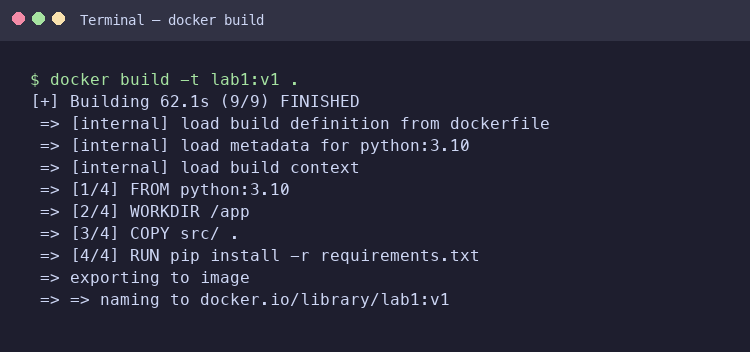
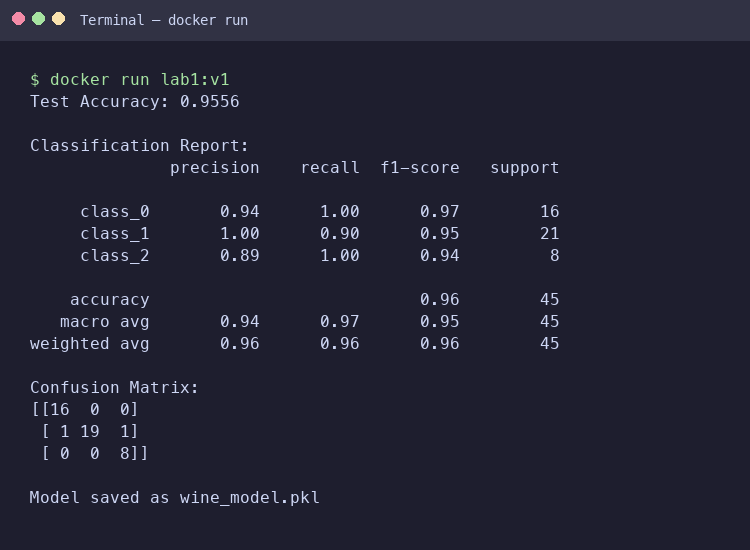

# Docker Lab 1 — Wine Classification with Gradient Boosting

This lab demonstrates containerizing a machine learning training pipeline using Docker.

## Changes from Original Lab

| Aspect | Original | Modified |
|--------|----------|----------|
| Dataset | Iris (150 samples, 4 features) | **Wine** (178 samples, 13 features) |
| Model | RandomForestClassifier | **GradientBoostingClassifier** |
| Evaluation | None | **Accuracy, Classification Report, Confusion Matrix** |
| Test Split | 20 % | **25 %** |

## Project Structure

```
Lab1/
├── ReadMe.md
├── dockerfile
└── src/
    ├── main.py
    └── requirements.txt
```

## How to Run

### Build the Docker image

```bash
docker build -t lab1:v1 .
```

### Run the container

```bash
docker run lab1:v1
```

### Save the image as a tar archive

```bash
docker save lab1:v1 > my_image.tar
```

## Screenshots

### Docker Build



### Docker Run


