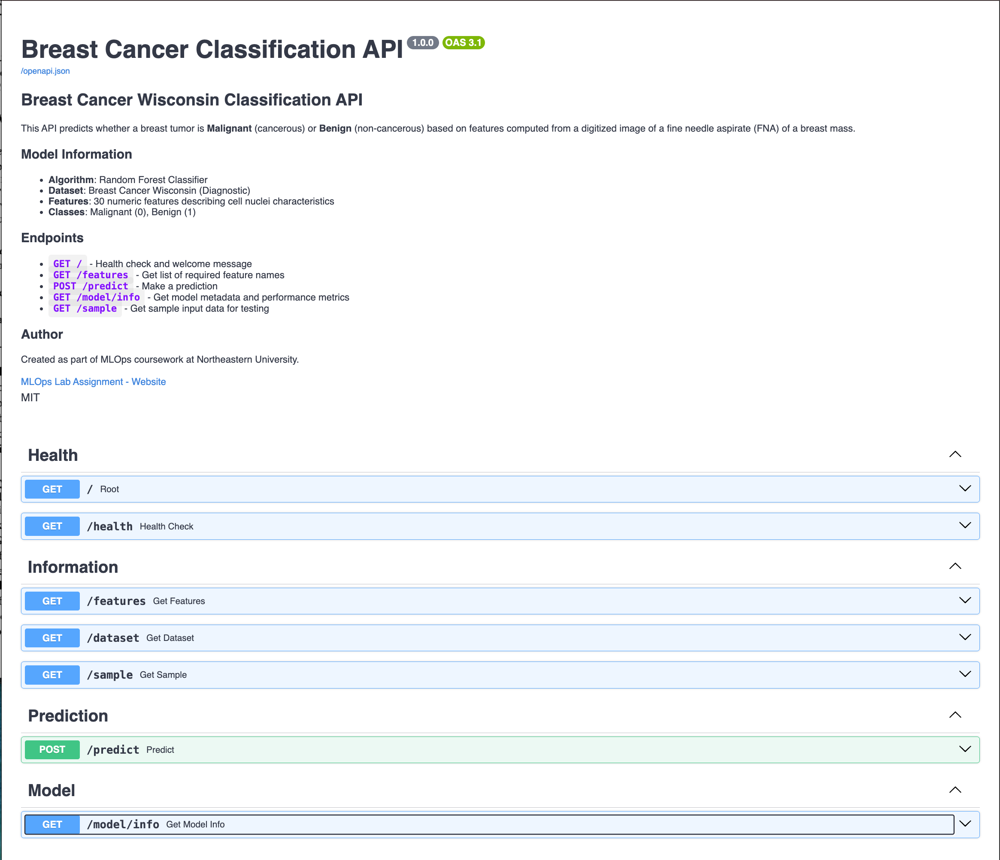
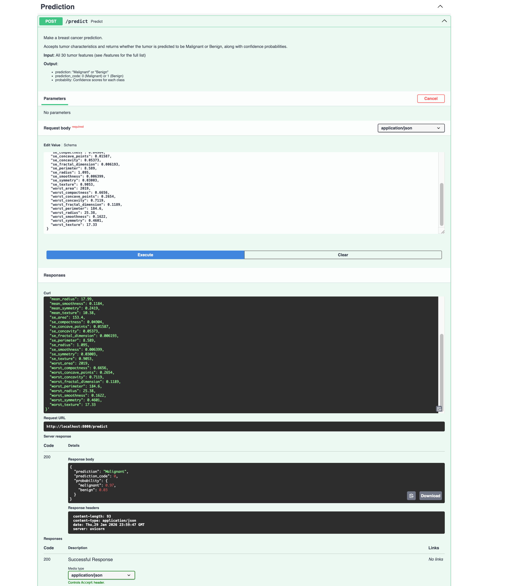

# Breast Cancer Classification API with FastAPI

A machine learning API built with FastAPI that predicts whether a breast tumor is **malignant** or **benign** using the Wisconsin Breast Cancer dataset.


## 📋 Project Overview

This project demonstrates MLOps practices by deploying a **Random Forest Classifier** trained on the **Breast Cancer Wisconsin dataset** as a REST API using FastAPI.

### Key Differences from Original Lab
- **Dataset**: Breast Cancer Wisconsin (instead of Iris)
- **Model**: Random Forest Classifier (instead of Decision Tree)
- **Features**: 30 numeric features describing cell nuclei characteristics
- **Target**: Binary classification (Malignant/Benign)

## 🗂️ Project Structure

```
FastApi Lab/
├── README.md
├── requirements.txt
├── src/
│   ├── __init__.py
│   ├── data.py          # Data loading and preprocessing
│   ├── train.py         # Model training script
│   ├── predict.py       # Prediction logic
│   └── main.py          # FastAPI application
├── model/
│   ├── model.pkl        # Trained Random Forest model
│   ├── scaler.pkl       # Feature scaler
│   └── metrics.pkl      # Model performance metrics
└── assets/
    ├── Overview.png            # API documentation screenshot
    ├── Prediction.png          # Prediction endpoint demo
    └── Model info.png          # Model info endpoint
```

## 📸 API Screenshots

### Swagger UI Overview
The interactive API documentation showing all available endpoints:



### Prediction Endpoint
Making a breast cancer prediction with sample tumor features:



### Model Information
Viewing model metadata and performance metrics:


## 🚀 Getting Started

### Prerequisites
- Python 3.9+
- pip

### Installation

1. **Clone the repository**
   ```bash
   git clone <your-repo-url>
   cd FastApi-Lab
   ```

2. **Create virtual environment**
   ```bash
   python -m venv venv
   source venv/bin/activate  # On Windows: venv\Scripts\activate
   ```

3. **Install dependencies**
   ```bash
   pip install -r requirements.txt
   ```

4. **Train the model**
   ```bash
   python src/train.py
   ```

5. **Run the API server**
   ```bash
   uvicorn src.main:app --reload
   ```

6. **Access the API documentation**
   - Swagger UI: http://localhost:8000/docs
   - ReDoc: http://localhost:8000/redoc

## 📊 Dataset Information

The **Breast Cancer Wisconsin (Diagnostic) Dataset** contains 569 samples with 30 features computed from digitized images of fine needle aspirates (FNA) of breast masses.

### Features (10 real-valued features computed for each cell nucleus):
- **radius** - mean of distances from center to points on the perimeter
- **texture** - standard deviation of gray-scale values
- **perimeter** - perimeter of the cell nucleus
- **area** - area of the cell nucleus
- **smoothness** - local variation in radius lengths
- **compactness** - perimeter² / area - 1.0
- **concavity** - severity of concave portions of the contour
- **concave points** - number of concave portions of the contour
- **symmetry** - symmetry of the cell nucleus
- **fractal dimension** - "coastline approximation" - 1

For each feature, the mean, standard error, and "worst" (mean of the three largest values) are computed, resulting in **30 features total**.

### Target Classes:
- **0**: Malignant (cancerous)
- **1**: Benign (non-cancerous)

## 🔌 API Endpoints

### Health Check
```
GET /
```
Returns API status and welcome message.

### Get Feature Names
```
GET /features
```
Returns the list of all 30 feature names required for prediction.

### Make Prediction
```
POST /predict
```
Accepts tumor measurements and returns prediction with probability.

**Example Request Body:**
```json
{
  "mean_radius": 17.99,
  "mean_texture": 10.38,
  "mean_perimeter": 122.8,
  "mean_area": 1001.0,
  "mean_smoothness": 0.1184,
  "mean_compactness": 0.2776,
  "mean_concavity": 0.3001,
  "mean_concave_points": 0.1471,
  "mean_symmetry": 0.2419,
  "mean_fractal_dimension": 0.07871,
  "se_radius": 1.095,
  "se_texture": 0.9053,
  "se_perimeter": 8.589,
  "se_area": 153.4,
  "se_smoothness": 0.006399,
  "se_compactness": 0.04904,
  "se_concavity": 0.05373,
  "se_concave_points": 0.01587,
  "se_symmetry": 0.03003,
  "se_fractal_dimension": 0.006193,
  "worst_radius": 25.38,
  "worst_texture": 17.33,
  "worst_perimeter": 184.6,
  "worst_area": 2019.0,
  "worst_smoothness": 0.1622,
  "worst_compactness": 0.6656,
  "worst_concavity": 0.7119,
  "worst_concave_points": 0.2654,
  "worst_symmetry": 0.4601,
  "worst_fractal_dimension": 0.1189
}
```

**Example Response:**
```json
{
  "prediction": "Malignant",
  "prediction_code": 0,
  "probability": {
    "malignant": 0.95,
    "benign": 0.05
  }
}
```

### Get Model Information
```
GET /model/info
```
Returns model metadata including accuracy and feature importances.

## 🧪 Testing the API

### Using curl:
```bash
curl -X POST "http://localhost:8000/predict" \
  -H "Content-Type: application/json" \
  -d '{"mean_radius": 17.99, "mean_texture": 10.38, ...}'
```

### Using Python:
```python
import requests

data = {
    "mean_radius": 17.99,
    "mean_texture": 10.38,
    # ... all 30 features
}

response = requests.post("http://localhost:8000/predict", json=data)
print(response.json())
```

## 📈 Model Performance

The Random Forest Classifier achieves the following metrics on the test set:

| Metric | Score |
|--------|-------|
| **Accuracy** | 95.6% |
| **Precision** | 95.6% |
| **Recall** | 95.6% |
| **F1 Score** | 95.6% |

### Classification Report
```
              precision    recall  f1-score   support

   Malignant       0.95      0.93      0.94        42
      Benign       0.96      0.97      0.97        72

    accuracy                           0.96       114
```

### Top 5 Most Important Features
1. `worst_area` (14.0%)
2. `worst_concave_points` (13.0%)
3. `worst_radius` (9.8%)
4. `mean_concave_points` (9.1%)
5. `worst_perimeter` (7.2%)

## 🛠️ Technologies Used

- **FastAPI** - Modern, fast web framework for building APIs
- **scikit-learn** - Machine learning library
- **Pydantic** - Data validation using Python type annotations
- **Uvicorn** - ASGI server for running the application
- **NumPy & Pandas** - Data manipulation

## 📝 License

This project is for educational purposes as part of the MLOps course at Northeastern University.

## 🙏 Acknowledgments

- Original lab structure inspired by [MLOps Labs by Ramin Mohammadi](https://github.com/raminmohammadi/MLOps)
- Dataset from [UCI Machine Learning Repository](https://archive.ics.uci.edu/ml/datasets/Breast+Cancer+Wisconsin+(Diagnostic))
