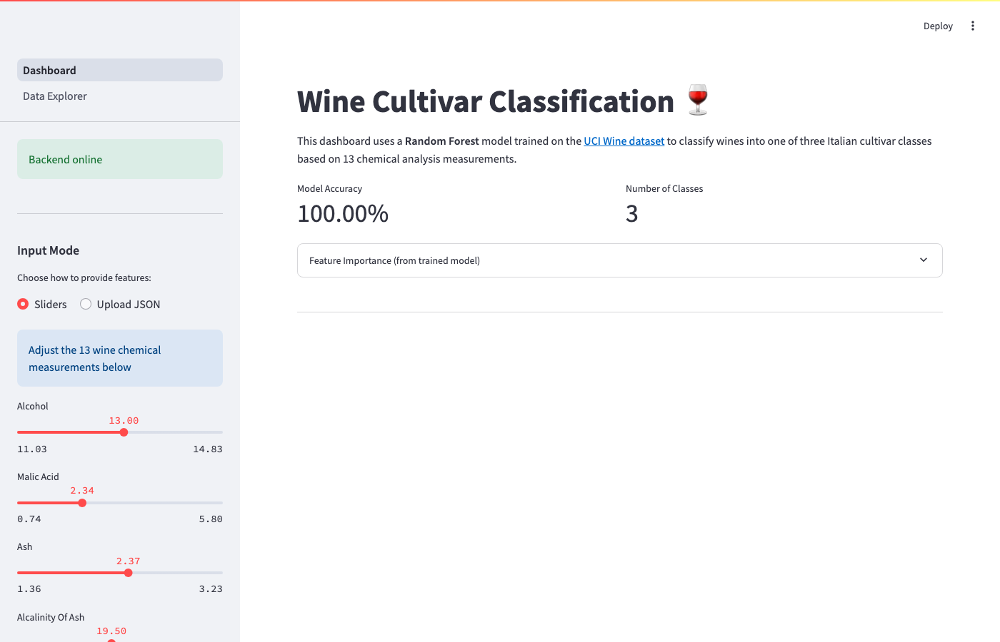
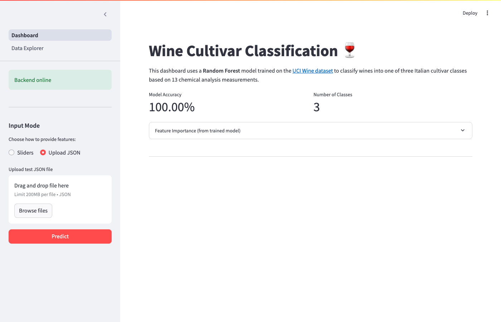
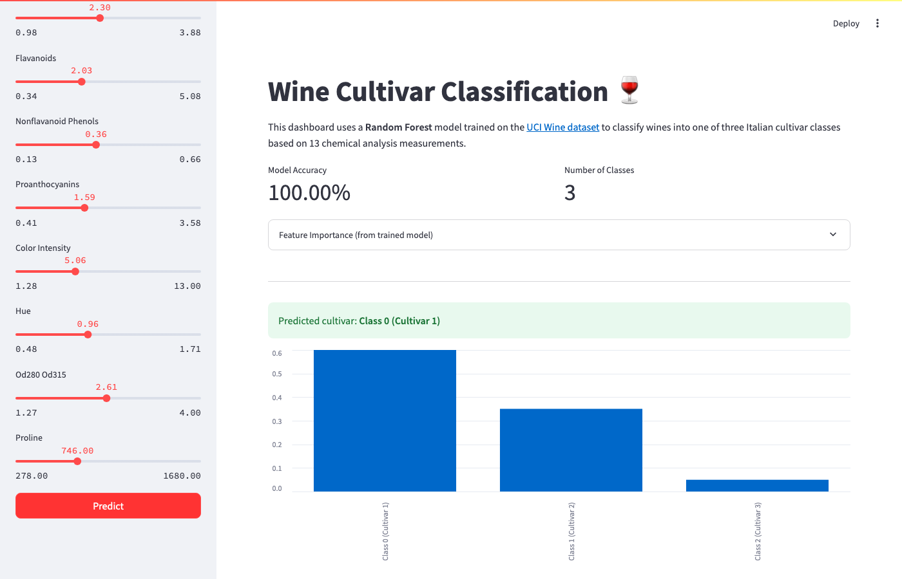
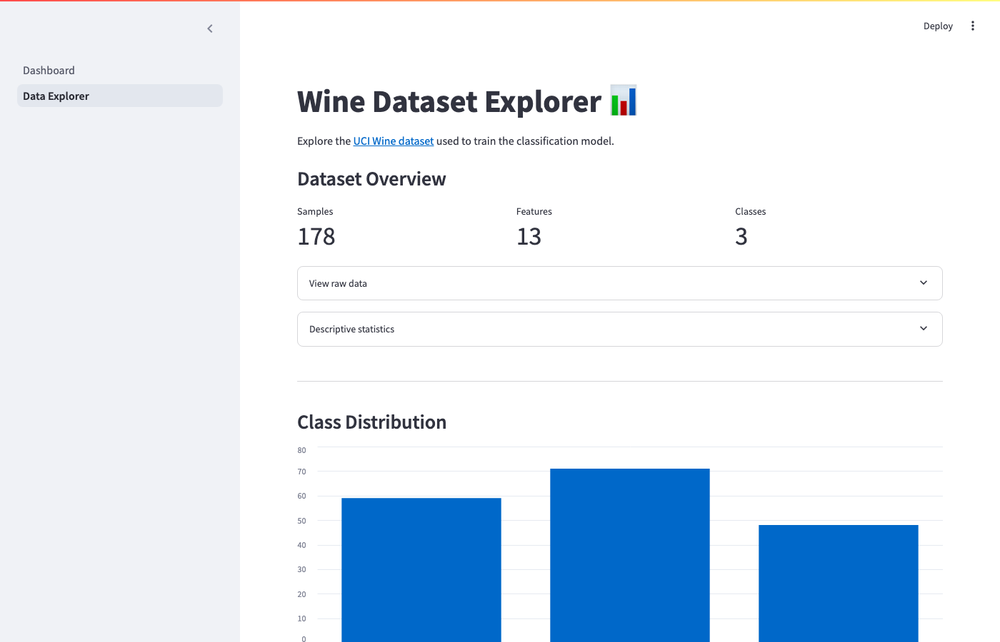

## Streamlit Lab — Wine Cultivar Classification

In this lab we build a multi-page **Streamlit** dashboard that communicates with a **FastAPI** backend to classify wines into one of three Italian cultivar classes. The machine-learning model is a **Random Forest Classifier** trained on the [UCI Wine dataset](https://archive.ics.uci.edu/dataset/109/wine) (13 chemical-analysis features, 178 samples, 3 classes).

> **Modifications from the original Streamlit Lab:**
> - **Different dataset** — Wine dataset (13 features) instead of Iris (4 features).
> - **Different model** — Random Forest instead of Decision Tree.
> - **Multi-page dashboard** — Added a *Data Explorer* page with EDA visualizations.
> - **Enhanced prediction output** — Shows class probabilities as a bar chart.
> - **Feature importance** — Displays the trained model's feature importances on the main page.



## Lab Objective

Before proceeding, we recommend completing the FastAPI backend section first. The backend trains and hosts the wine classification model. In this lab we build a clean, user-friendly Streamlit interface on top of that backend.

## Project Structure

```
.
├── README.md
├── requirements.txt
├── .gitignore
├── assets/                 # Screenshots (optional)
├── backend/
│   ├── __init__.py
│   ├── data.py             # Load & split Wine dataset
│   ├── train.py            # Train Random Forest & save artifacts
│   ├── predict.py          # Load model & run inference
│   ├── main.py             # FastAPI application
│   └── model/              # Generated model artifacts
├── src/
│   ├── __init__.py
│   ├── Dashboard.py        # Main Streamlit page (prediction)
│   └── pages/
│       └── 1_Data_Explorer.py  # EDA & visualization page
└── data/
    └── test.json           # Sample JSON for testing
```

## Installing Required Packages

### Installing from requirements.txt

1. Create a virtual environment:
```
python3 -m venv streamlitenv
```

2. Activate the virtual environment:

For Mac & Linux:
```
source ./streamlitenv/bin/activate
```
For Windows:
```
.\streamlitenv\Scripts\activate
```

3. Install packages:
```
pip install -r requirements.txt
```

### Alternative installation

```
pip install streamlit fastapi uvicorn scikit-learn pandas numpy joblib
```

## Hello World in Streamlit

The best way to explore Streamlit is to start with the built-in demo:

```
streamlit hello
```

This starts a server on port `8501` with an interactive showcase. Click around and explore the examples before continuing.

## Training the Model

Before building the dashboard, we need a trained model. Navigate into the `backend/` directory and run:

```
cd backend
python train.py
```

This script:
1. Loads the Wine dataset from scikit-learn.
2. Splits it into training and testing sets (70/30).
3. Trains a `RandomForestClassifier` with 100 estimators.
4. Saves `wine_model.pkl`, `metrics.json`, and `feature_importance.json` to `backend/model/`.

Let's look at the key training code:

```Python
from sklearn.ensemble import RandomForestClassifier

def fit_model(X_train, y_train):
    rf_classifier = RandomForestClassifier(
        n_estimators=100,
        max_depth=5,
        random_state=42
    )
    rf_classifier.fit(X_train, y_train)
    return rf_classifier
```

Unlike the original lab which uses a `DecisionTreeClassifier`, we use a `RandomForestClassifier` — an ensemble of decision trees that typically provides better accuracy and generalization.

## Starting the FastAPI Backend

From the `backend/` directory:

```
cd backend
uvicorn main:app --reload
```

The API will be available at `http://localhost:8000`. Visit `http://localhost:8000/docs` for the auto-generated Swagger UI.

The backend exposes two endpoints:

| Method | Endpoint   | Description |
|--------|-----------|-------------|
| GET    | `/`       | Health check — returns `{"status": "healthy"}` |
| POST   | `/predict` | Accepts 13 wine features, returns predicted class + probabilities |

The `/predict` endpoint accepts a JSON body with 13 features:

```JSON
{
    "alcohol": 13.2,
    "malic_acid": 1.78,
    "ash": 2.14,
    "alcalinity_of_ash": 11.2,
    "magnesium": 100.0,
    "total_phenols": 2.65,
    "flavanoids": 2.76,
    "nonflavanoid_phenols": 0.26,
    "proanthocyanins": 1.28,
    "color_intensity": 4.38,
    "hue": 1.05,
    "od280_od315": 3.40,
    "proline": 1050.0
}
```

And returns:

```JSON
{
    "prediction": 0,
    "class_name": "Class 0 (Cultivar 1)",
    "probabilities": {
        "Class 0 (Cultivar 1)": 0.92,
        "Class 1 (Cultivar 2)": 0.05,
        "Class 2 (Cultivar 3)": 0.03
    }
}
```

## Building the Streamlit UI Step-by-Step

When creating a dashboard, the first step is determining the layout. Our dashboard has:
- A **sidebar** for backend status, input controls, and the predict button.
- A **main body** showing the title, model metrics, feature importance, and prediction results.
- A **second page** (Data Explorer) for dataset exploration and visualization.

### Building the Sidebar

```Python
import json
import requests
import streamlit as st
import pandas as pd
from pathlib import Path
from streamlit.logger import get_logger

FASTAPI_BACKEND_ENDPOINT = "http://localhost:8000"
FASTAPI_WINE_MODEL_LOCATION = Path(__file__).resolve().parents[1] / 'backend' / 'model' / 'wine_model.pkl'

LOGGER = get_logger(__name__)

def run():
    st.set_page_config(
        page_title="Wine Classification Dashboard",
        page_icon="🍷",
        layout="wide",
    )

    with st.sidebar:
        try:
            backend_request = requests.get(FASTAPI_BACKEND_ENDPOINT, timeout=5)
            if backend_request.status_code == 200:
                st.success("Backend online")
            else:
                st.warning("Problem connecting to backend")
        except requests.ConnectionError:
            st.error("Backend offline — start the FastAPI server")
```

Let's break down the code:

```Python
import json
import requests
import streamlit as st
import pandas as pd
from pathlib import Path
from streamlit.logger import get_logger
```

We begin by importing the necessary modules:
1. `json` — encode/decode JSON data for API communication.
2. `requests` — send HTTP requests from Streamlit to the FastAPI backend.
3. `streamlit` — the dashboard framework.
4. `pandas` — data manipulation for displaying probability charts.
5. `pathlib` — navigate the local file system to locate the model file.
6. `get_logger` — Streamlit's built-in logger for debugging.

Inside the `run` function, we configure the page title, icon, and wide layout:

```Python
st.set_page_config(
    page_title="Wine Classification Dashboard",
    page_icon="🍷",
    layout="wide",
)
```

[`st.set_page_config` docs](https://docs.streamlit.io/library/api-reference/utilities/st.set_page_config)

The `with st.sidebar:` block creates the sidebar. We first check if the FastAPI backend is running by sending a GET request. The response is shown using colored status boxes:

1. [`st.success`](https://docs.streamlit.io/library/api-reference/status/st.success) — green box when backend is online.
2. [`st.warning`](https://docs.streamlit.io/library/api-reference/status/st.warning) — yellow box when there's a connection problem.
3. [`st.error`](https://docs.streamlit.io/library/api-reference/status/st.error) — red box when backend is offline.


### Input Mode Selection

Because we have 13 features (more than the original Iris lab's 4), we offer two input modes via a radio button:

```Python
input_mode = st.radio(
    "Choose how to provide features:",
    ["Sliders", "Upload JSON"],
    horizontal=True,
)
```

[`st.radio` docs](https://docs.streamlit.io/library/api-reference/widgets/st.radio)

#### Slider Mode

When the user selects "Sliders", we dynamically generate 13 sliders from a dictionary of feature ranges:

```Python
FEATURE_RANGES = {
    "alcohol":             (11.03, 14.83, 13.00),
    "malic_acid":          (0.74, 5.80, 2.34),
    "ash":                 (1.36, 3.23, 2.37),
    ...
}

for feat, (lo, hi, default) in FEATURE_RANGES.items():
    step = round((hi - lo) / 100, 3) or 0.01
    slider_values[feat] = st.slider(
        feat.replace("_", " ").title(),
        min_value=lo,
        max_value=hi,
        value=default,
        step=step,
        format="%.2f",
    )
```

Each tuple contains `(min_value, max_value, default_value)` derived from the dataset statistics. The step size is automatically calculated.

[`st.slider` docs](https://docs.streamlit.io/library/api-reference/widgets/st.slider)

#### JSON Upload Mode

Alternatively, the user can upload a JSON file using `st.file_uploader`:

```Python
uploaded = st.file_uploader("Upload test JSON file", type=["json"])
if uploaded:
    st.write("Preview:")
    test_input_data = json.load(uploaded)
    st.json(test_input_data)
    st.session_state["uploaded_json"] = test_input_data
```

[`st.file_uploader` docs](https://docs.streamlit.io/library/api-reference/widgets/st.file_uploader)



The uploaded JSON is previewed with [`st.json`](https://docs.streamlit.io/library/api-reference/data/st.json) and stored in [`st.session_state`](https://docs.streamlit.io/library/api-reference/session-state) so it persists across re-renders.

An example `test.json` file is provided in the `data/` folder:

```JSON
{
    "input_test": {
        "alcohol": 13.2,
        "malic_acid": 1.78,
        "ash": 2.14,
        "alcalinity_of_ash": 11.2,
        "magnesium": 100.0,
        "total_phenols": 2.65,
        "flavanoids": 2.76,
        "nonflavanoid_phenols": 0.26,
        "proanthocyanins": 1.28,
        "color_intensity": 4.38,
        "hue": 1.05,
        "od280_od315": 3.40,
        "proline": 1050.0
    }
}
```

Finally, the sidebar ends with a styled predict button:

```Python
predict_button = st.button("Predict", type="primary", use_container_width=True)
```

[`st.button` docs](https://docs.streamlit.io/library/api-reference/widgets/st.button)

### Building the Body

The main body displays the title, model metrics, feature importance, and prediction results.

#### Title and Model Metrics

```Python
st.write("# Wine Cultivar Classification 🍷")

col1, col2 = st.columns(2)
if METRICS_PATH.is_file():
    with open(METRICS_PATH) as f:
        metrics = json.load(f)
    col1.metric("Model Accuracy", f"{metrics['accuracy']:.2%}")
    col2.metric("Number of Classes", "3")
```

[`st.metric`](https://docs.streamlit.io/library/api-reference/data/st.metric) displays a large number with a label — useful for KPIs.

[`st.columns`](https://docs.streamlit.io/library/api-reference/layout/st.columns) creates a horizontal layout with equal-width columns.

#### Feature Importance

```Python
if FEATURE_IMPORTANCE_PATH.is_file():
    with open(FEATURE_IMPORTANCE_PATH) as f:
        importance = json.load(f)
    with st.expander("Feature Importance (from trained model)"):
        imp_df = pd.DataFrame(
            sorted(importance.items(), key=lambda x: x[1], reverse=True),
            columns=["Feature", "Importance"],
        )
        st.bar_chart(imp_df.set_index("Feature"))
```

[`st.expander`](https://docs.streamlit.io/library/api-reference/layout/st.expander) creates a collapsible section so the chart doesn't overwhelm the page.

[`st.bar_chart`](https://docs.streamlit.io/library/api-reference/charts/st.bar_chart) renders a bar chart of feature importances extracted from the trained Random Forest model.

#### Prediction Logic

```Python
def send_prediction(client_input: dict) -> None:
    result_container = st.empty()
    prob_container = st.empty()
    try:
        with st.spinner("Classifying wine..."):
            response = requests.post(
                f"{FASTAPI_BACKEND_ENDPOINT}/predict",
                json=client_input,
                timeout=10,
            )
        if response.status_code == 200:
            result = response.json()
            pred_class = result["class_name"]
            result_container.success(f"Predicted cultivar: **{pred_class}**")

            prob_df = pd.DataFrame(
                list(result["probabilities"].items()),
                columns=["Class", "Probability"],
            )
            prob_container.bar_chart(prob_df.set_index("Class"))
    except requests.ConnectionError:
        st.toast(":red[Cannot reach backend.]", icon="🔴")
```

Key Streamlit components used here:

1. [`st.empty`](https://docs.streamlit.io/library/api-reference/layout/st.empty) — a placeholder container that can be updated dynamically.
2. [`st.spinner`](https://docs.streamlit.io/library/api-reference/status/st.spinner) — displays a loading animation while the API call is in progress.
3. [`st.toast`](https://docs.streamlit.io/library/api-reference/status/st.toast) — shows a temporary notification if something goes wrong.

Unlike the original lab which only shows the predicted class name, our version also displays a **probability bar chart** so the user can see the model's confidence across all three classes.



## Running the Streamlit Dashboard

In a new terminal (with the FastAPI backend already running):

```
cd src
streamlit run Dashboard.py
```

This opens the dashboard at `http://localhost:8501`.

## Multi-Page Application — Data Explorer

Streamlit supports multi-page apps through a simple convention: place additional `.py` files inside a `pages/` directory next to your main script. The files are named with a prefix like `1_`, `2_`, etc. to control the sidebar ordering.

[Multi-page app docs](https://docs.streamlit.io/get-started/tutorials/create-a-multipage-app)

Our `1_Data_Explorer.py` page provides interactive visualizations of the Wine dataset:

```Python
import streamlit as st
import pandas as pd
from sklearn.datasets import load_wine

@st.cache_data
def get_wine_dataframe():
    wine = load_wine()
    df = pd.DataFrame(wine.data, columns=wine.feature_names)
    df["target"] = wine.target
    df["class_name"] = df["target"].map(
        {i: name for i, name in enumerate(wine.target_names)}
    )
    return df, wine.feature_names
```

[`@st.cache_data`](https://docs.streamlit.io/library/api-reference/performance/st.cache_data) caches the dataset so it's only loaded once, even when the user interacts with widgets and the script re-runs.


The Data Explorer page includes:

1. **Dataset overview** — sample count, feature count, class count using `st.metric`.
2. **Raw data viewer** — `st.dataframe` inside an `st.expander`.
3. **Descriptive statistics** — `df.describe()` output.
4. **Class distribution** — bar chart showing how many samples belong to each cultivar.
5. **Feature distribution by class** — select any feature from a dropdown (`st.selectbox`) and see a line chart broken down by class.
6. **Correlation heatmap** — Pearson correlation matrix with a color gradient.
7. **2-D scatter plot** — pick any two features for X and Y axes using `st.selectbox`, visualized with `st.scatter_chart` and colored by class.



## Summary of Commands

```bash
# 1. Set up environment
python3 -m venv streamlitenv
source ./streamlitenv/bin/activate
pip install -r requirements.txt

# 2. Train the model
cd backend
python train.py

# 3. Start FastAPI backend
uvicorn main:app --reload

# 4. Start Streamlit frontend (new terminal)
cd src
streamlit run Dashboard.py
```
