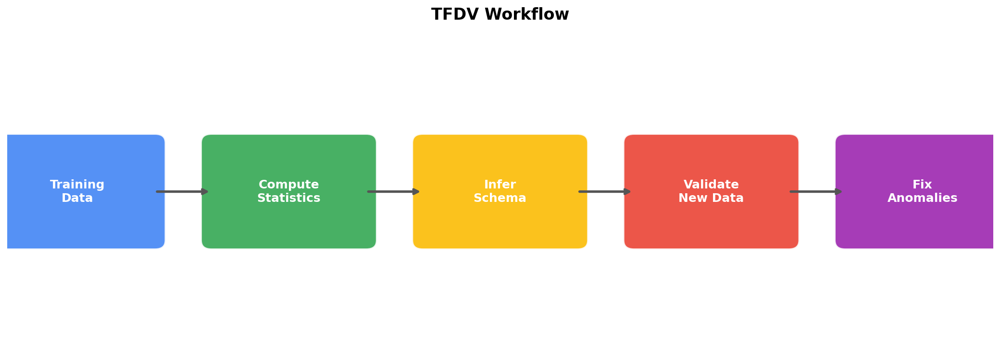
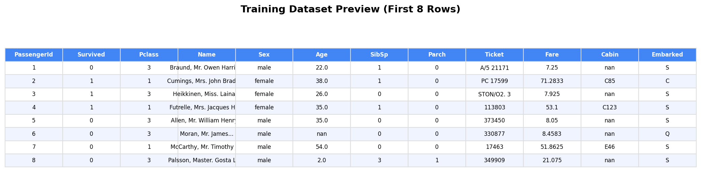
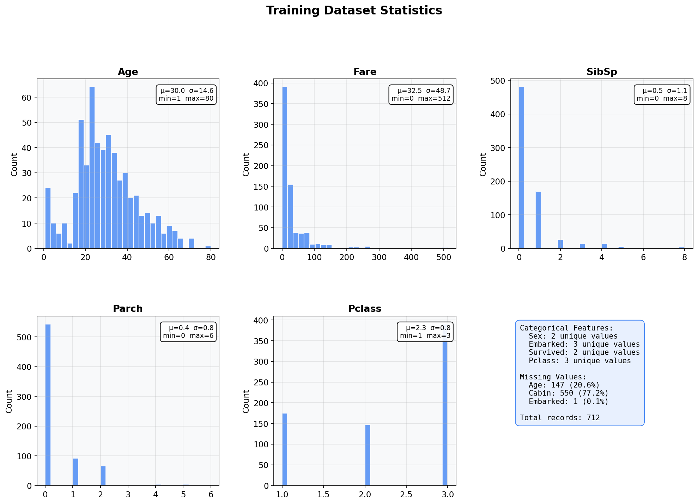
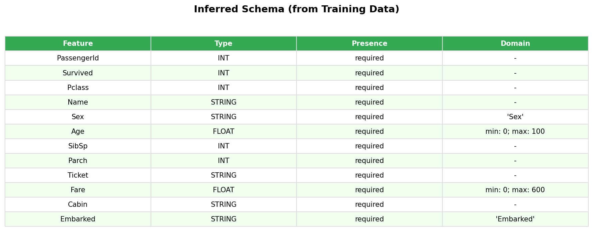
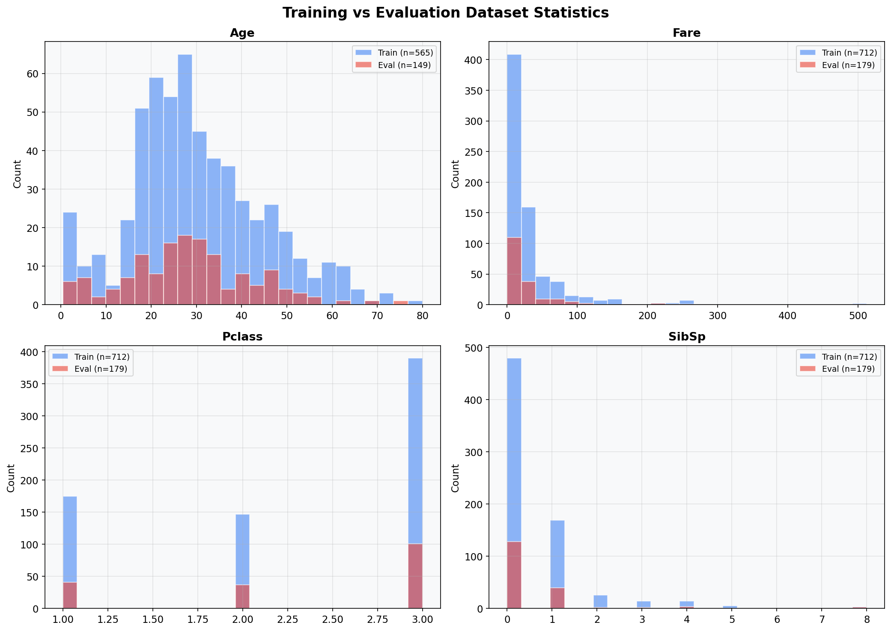
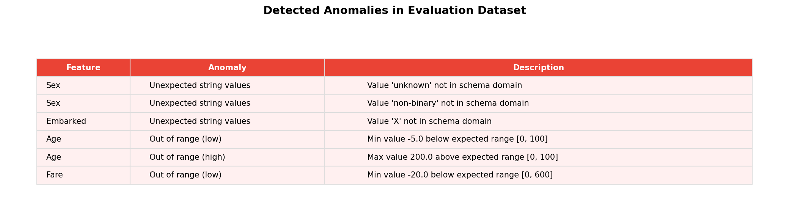
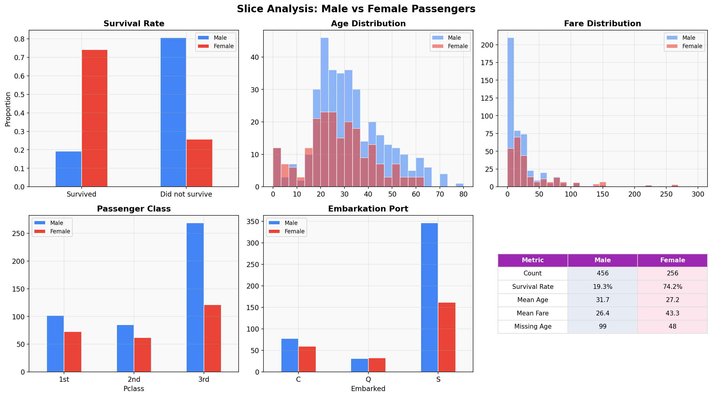
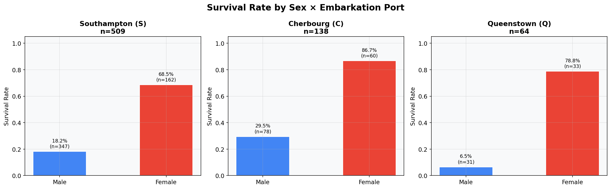

# TFDV Lab — Titanic Dataset

This lab demonstrates the use of [TensorFlow Data Validation (TFDV)](https://www.tensorflow.org/tfx/data_validation/get_started) to analyze, validate, and monitor ML data quality using the **Titanic** dataset.

This is a modified version of the [original TFDV Lab1](https://github.com/raminmohammadi/MLOps/tree/main/Labs/Tensorflow_Labs/TFDV_Labs/TFDV_Lab1) from the MLOps course, adapted to use a different dataset while following the same TFDV workflow.

---

## TFDV Workflow

The diagram below summarizes the TFDV workflow used in this lab:



---

## Key Modifications from Original Lab

| Aspect | Original Lab | This Lab |
|--------|-------------|----------|
| **Dataset** | Census Income (Adult) | Titanic |
| **Target Variable** | Income (<=50K / >50K) | Survived (0 / 1) |
| **Feature Types** | 14 features (6 numerical, 8 categorical) | 11 features (5 numerical, 6 categorical) |
| **Anomalous Rows** | Invalid age, missing workclass, new race/country/occupation values | Invalid age (-5, 200), negative fare, unknown sex, invalid embarkation port |
| **Slicing Analysis** | Sex, Race x Sex | Sex, Sex x Embarked |
| **Schema Fixes** | Relax native-country/occupation, add Asian to race domain, restrict age range | Relax Embarked/Sex domains, add unknown/non-binary to Sex, restrict Age and Fare ranges |

---

## Lab Contents

```
TFDV Lab/
├── TFDV_Lab1.ipynb       # Main lab notebook
├── util.py               # Utility function to inject anomalous rows
├── generate_images.py    # Script to generate README images
├── data/
│   └── titanic.csv       # Titanic dataset
├── img/                  # Images used in notebook and README
└── requirements.txt      # Python dependencies
```

---

## Step-by-Step Walkthrough

### 1. Load and Preview the Dataset

The Titanic dataset contains 891 passenger records with features like Age, Sex, Pclass, Fare, and Embarked. It is split into 80% training and 20% evaluation sets.



### 2. Generate and Visualize Training Statistics

TFDV computes descriptive statistics for both numerical and categorical features. Below are the distributions of key numerical features along with categorical feature summaries and missing value counts.



Key observations:
- **Age**: Mean ~30 years, with 20.6% missing values
- **Fare**: Highly right-skewed, ranging from 0 to 512
- **Cabin**: 77.2% missing — the most incomplete feature
- **Pclass**: Majority of passengers in 3rd class

### 3. Infer Data Schema

TFDV automatically infers a schema from the training data, including expected types, presence requirements, and domain constraints for categorical features.



### 4. Compare Training vs Evaluation Statistics

Side-by-side comparison of training and evaluation dataset distributions helps detect distribution skew before it impacts model performance.



### 5. Detect Anomalies

After injecting malformed rows into the evaluation dataset (via `util.py`), TFDV detects several anomalies:



Anomalies include:
- **Sex**: Unexpected values `unknown` and `non-binary` not in training schema
- **Embarked**: Unexpected value `X` not in training schema
- **Age**: Values `-5` and `200` outside expected range [0, 100]
- **Fare**: Value `-20.0` outside expected range [0, 600]

### 6. Fix Anomalies by Revising the Schema

Anomalies are resolved through schema modifications:
- **Relax domain constraints**: Set `min_domain_mass = 0.9` for `Sex` and `Embarked` to tolerate small fractions of unexpected values
- **Expand domain**: Add `unknown` and `non-binary` to the `Sex` domain
- **Restrict numerical ranges**: Set `Age` to [0, 100] and `Fare` to [0, 600]

### 7. Slice-Based Analysis: Male vs Female

TFDV supports slicing data by feature values for detailed subgroup analysis. Below is a comparison of male vs female passengers:



Key findings:
- **Survival rate**: Female passengers had a 74.2% survival rate vs 19.3% for males
- **Fare**: Female passengers paid higher fares on average ($43.3 vs $26.4)
- **Class distribution**: Males were disproportionately in 3rd class

### 8. Multi-Feature Slicing: Sex x Embarked

Combining multiple features for slicing reveals deeper patterns across subgroups:



This reveals that the "women and children first" policy was consistently applied across all embarkation ports, though survival rates varied by port.

---

## Setup

```bash
pip install -r requirements.txt
```

Then open `TFDV_Lab1.ipynb` in Jupyter and run the cells sequentially.

> **Note**: TFDV requires Linux x86_64 or can be run via Docker on macOS. If running on macOS ARM (Apple Silicon), consider using a Docker container or Google Colab.

## Dataset

The [Titanic dataset](https://www.kaggle.com/c/titanic) contains passenger information from the RMS Titanic. Features include:

| Feature | Type | Description |
|---------|------|-------------|
| PassengerId | INT | Unique identifier |
| Survived | INT | 0 = No, 1 = Yes |
| Pclass | INT | Ticket class (1st, 2nd, 3rd) |
| Name | STRING | Passenger name |
| Sex | STRING | male / female |
| Age | FLOAT | Age in years |
| SibSp | INT | Siblings/spouses aboard |
| Parch | INT | Parents/children aboard |
| Ticket | STRING | Ticket number |
| Fare | FLOAT | Passenger fare |
| Cabin | STRING | Cabin number |
| Embarked | STRING | Port (C/Q/S) |

## References

- [Original Lab (MLOps Course)](https://github.com/raminmohammadi/MLOps/tree/main/Labs/Tensorflow_Labs/TFDV_Labs/TFDV_Lab1)
- [TFDV Guide](https://www.tensorflow.org/tfx/data_validation/get_started)
- [TFDV API Docs](https://www.tensorflow.org/tfx/data_validation/api_docs/python/tfdv)
- [TFX Paper](http://stevenwhang.com/tfx_paper.pdf)
- [Titanic Dataset (Kaggle)](https://www.kaggle.com/c/titanic)
